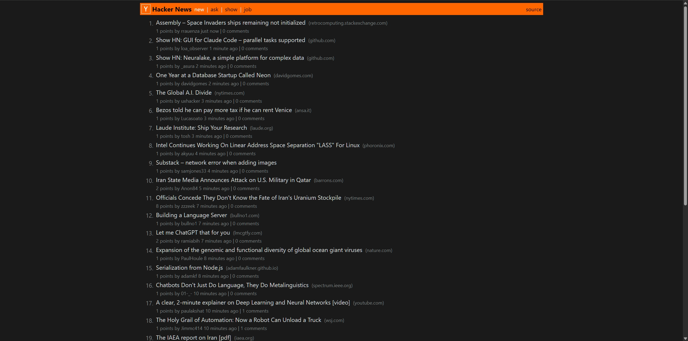

# Hacker News

> A high-performance, production-ready Hacker News clone built with pure Go and modern best practices.

This project is a minimalist, read-only clone of Hacker News, focusing on extreme performance, a clean codebase, and a modern, secure deployment pipeline. It uses the official Hacker News Firebase API and is built with zero external Go dependencies.



---

## ✨ Features

*   **Blazing Fast Performance**: Proactive background caching for main story lists means pages load almost instantly. A bounded worker pool is used for fetching item details efficiently without overwhelming the API.
*   **Modern Semantic UI**: The frontend is built with clean, semantic HTML5 and styled with modern CSS (Flexbox, dark/light mode support). No legacy `<table>` layouts.
*   **Full Pagination**: Complete "More" link functionality allows users to browse through all available stories, not just the first 30.
*   **Production-Grade Backend**:
    *   **Clean Architecture**: A layered, modular structure (`cmd`, `internal`) for clear separation of concerns.
    *   **Structured Logging**: Uses Go's `slog` for machine-readable JSON logs.
    *   **Graceful Shutdown**: The server handles interrupt signals to finish in-flight requests before closing.
*   **Secure, Minimalist Deployment**:
    *   **Multi-Stage Docker Build**: Creates a tiny, optimized production image.
    *   **Distroless Image**: The final container uses Google's `distroless/static` image, which contains *only* the application binary, providing a minimal attack surface.
    *   **Non-Root User**: The container runs as a non-root user for enhanced security.

---

## 🚀 Running the Application

### Using Docker (Recommended)

This is the simplest and most secure way to run the application.

1.  **Build the Docker image:**
    ```bash
    docker build -t hackernews .
    ```

2.  **Run the container:**
    ```bash
    docker run -p 3000:3000 hackernews
    ```

3.  Open your browser and navigate to `http://localhost:3000`.

### Using Go (Local Development)

This method is for developers who want to work on the code.

1.  **Ensure you have Go installed** (version 1.22 or later).

2.  **Run the server from the project root:**
    ```bash
    go run ./cmd/server/main.go
    ```

3.  Open your browser and navigate to `http://localhost:3000`.

---

## 🛠️ Tech Stack

*   **Backend**: **Go 1.22+** (Standard Library only)
*   **Frontend**: **HTML5**, **CSS3** (Flexbox, System Dark Mode)
*   **API**: Official Hacker News Firebase API
*   **Containerization**: **Docker**, **Distroless Images**

---

## 🏗️ Project Structure

The project follows a standard layered Go application structure.

```txt
/hackernews
├── cmd/server/         # Main application entrypoint and web asset embedding
├── internal/           # All core application logic (not publicly importable)
│   ├── cache/          # Generic, thread-safe cache and background refresher
│   ├── config/          # Application configuration management
│   ├── handler/        # HTTP handlers and routing
│   ├── hn/             # Hacker News API client and data models
│   └── view/           # Template parsing and rendering logic
├── Dockerfile           # Multi-stage, production-ready Docker build
└── go.mod              # Go module definition
